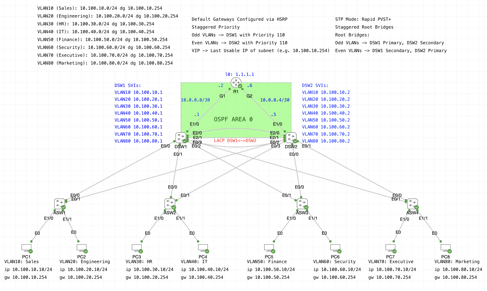

# Collapsed Core/Distribution Enterprise LAN with VLANs, STP, HSRP, and OSPF

This lab simulates a realistic small-to-medium enterprise LAN using a **collapsed core/distribution architecture**. The network features VLAN segmentation, redundant distribution switches with HSRP, STP for loop prevention, and OSPF for dynamic routing to the core router. It demonstrates real-world Layer 2 and Layer 3 enterprise design.

---

## Key Features

- 8 VLANs with subnetting and gateway IP structure
- Redundant L2 uplinks from each Access Switch to both DSWs
- HSRP gateway failover with **load balancing** (odd VLANs = DSW1 primary, even VLANs = DSW2 primary)
- **Rapid PVST+** spanning-tree with staggered root bridge priorities
- LACP link aggregation between DSW1 and DSW2
- OSPF Area 0 routing between DSWs and core router
- Central router with Loopback advertised (1.1.1.1/32)

---

## Topology

---

## VLAN Design

| VLAN | Name         | Subnet              | Gateway VIP        |
|------|--------------|---------------------|---------------------|
| 10   | Sales        | 10.100.10.0/24      | 10.100.10.254       |
| 20   | Engineering  | 10.100.20.0/24      | 10.100.20.254       |
| 30   | HR           | 10.100.30.0/24      | 10.100.30.254       |
| 40   | IT           | 10.100.40.0/24      | 10.100.40.254       |
| 50   | Finance      | 10.100.50.0/24      | 10.100.50.254       |
| 60   | Security     | 10.100.60.0/24      | 10.100.60.254       |
| 70   | Executive    | 10.100.70.0/24      | 10.100.70.254       |
| 80   | Marketing    | 10.100.80.0/24      | 10.100.80.254       |

- SVIs are configured on DSW1 and DSW2 for each VLAN
- Gateway IPs (.254) handled via HSRP with failover and load balancing

---

## Routing Configuration

| Component | Protocol | Interfaces/Subnets |
|----------|----------|--------------------|
| R1 ↔ DSW1 | OSPF Area 0 | 10.0.0.0/30 |
| R1 ↔ DSW2 | OSPF Area 0 | 10.0.0.4/30 |
| Loopback | 1.1.1.1/32 | Advertised in OSPF |

- OSPF used for dynamic routing between R1 and both DSWs
- Loopback on R1 reachable from both distribution switches

---

## Redundancy & High Availability

| Protocol | Role |
|----------|------|
| **HSRP** | Default gateway redundancy per VLAN |
| **STP**  | Loop prevention with Rapid PVST+, root bridge per VLAN |
| **LACP** | Port-channel between DSW1 and DSW2 |
| **Dual Uplinks** | From each ASW to DSW1 and DSW2 |

- Odd VLANs: DSW1 is STP root & HSRP active
- Even VLANs: DSW2 is STP root & HSRP active

---

## Verification Commands

| Task                         | Command                                 |
|------------------------------|------------------------------------------|
| Verify HSRP state            | `show standby`                           |
| Verify STP role & root       | `show spanning-tree vlan X`             |
| Confirm OSPF neighbors       | `show ip ospf neighbor`                 |
| Check routing table          | `show ip route`                         |
| Test end-to-end reachability | `ping <destination IP>` from PCs        |
| Test convergence             | Shutdown uplinks, observe HSRP/STP failover |

---

## Config Files

All config files are available under the `/configs/` directory:

- [R1 (Router)](configs/R1.txt)
- [DSW1](configs/DSW1.txt)
- [DSW2](configs/DSW2.txt)
- [ASW1](configs/ASW1.txt)
- [ASW2](configs/ASW2.txt)
- [ASW3](configs/ASW3.txt)
- [ASW4](configs/ASW4.txt)

---

## Summary

This lab models a full-stack enterprise LAN with both Layer 2 and Layer 3 design considerations. It is intended to demonstrate production-ready skills in:
- VLAN segmentation
- Redundant routing and switching
- Spanning Tree tuning
- High availability via HSRP
- OSPF dynamic routing

This lab represents a realistic deployment-level scenario and serves as a flagship project in my networking portfolio.

